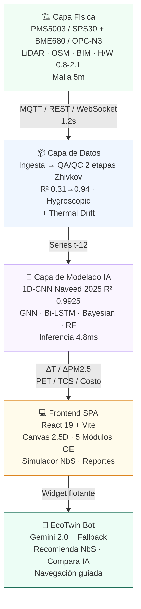

<div align="center">

# 🌿 Gemelo Digital Microescala — Calidad del Aire y NbS | Trujillo, Perú

### Simulador físico-virtual a 5 m × 5 m para mitigar contaminantes e isla de calor urbana con IoT, IA y Soluciones basadas en la Naturaleza

<p>
  <a href="https://github.com/jfloriana/gemelo-digital-trujillo"></a>
  <a href="https://vercel.com"></a>
  
  
  
  
</p>

<p>
  
  
  
  
  
</p>

**Proyecto de Tesis de Posgrado — Universidad Nacional de Trujillo** · Investigación aplicada a planificación urbana, salud pública y resiliencia climática en ciudades intermedias costeras

[🚀 Demo en Vercel](#despliegue) · [📖 Documentación](#tabla-de-contenidos) · [🐛 Reportar Issue](https://github.com/jfloriana/gemelo-digital-trujillo/issues) · [✉️ Contacto](#licencia-y-créditos)

</div>

---

<div align="center">

| Investigador Líder | Ámbito | Resolución | Beneficio Estimado |
| :---: | :---: | :---: | :---: |
| **Ing. Joel Arevalo** | 6 zonas: Centro Histórico, Mayorista, Mansiche, El Porvenir, Víctor Larco, La Hermelinda | **5 m × 5 m** · H/W 0.8 – 2.1 | **132 500 hab.** · 41 000 en riesgo crítico protegidos |

</div>

---

## ✨ Vista Previa

<div align="center">

> **Gemelo Digital 3D en Vivo** + **Simulador NbS A/B** + **Asistente IA EcoTwin** — Todo en una SPA sin backend, lista para Vercel.

```
┌─────────────────────────────────────────────────────────────────────────┐
│  🗺️  Canvas 2.5D Isométrico  │  📊 Gráficos Recharts  │  🤖 Chatbot IA  │
│  Cañón urbano · Malla 5m    │  Series horarias    │  Gemini + fallback │
│  Flujo LBM · Gradiente UHI  │  Barras & Radar     │  Recomienda NbS     │
└─────────────────────────────────────────────────────────────────────────┘
```

*Screenshots: añade tus capturas en `docs/` y reemplaza este bloque por ``*

</div>

---

## 📑 Tabla de Contenidos

<details>
<summary><strong>クリック para expandir</strong></summary>

- [Características Principales](#-características-principales)
- [Stack Tecnológico](#-stack-tecnológico)
- [Arquitectura del Sistema](#-arquitectura-del-sistema)
- [Asistente IA — EcoTwin Bot](#-asistente-ia--ecotwin-bot)
- [Requisitos Previos](#-requisitos-previos)
- [Instalación](#-instalación)
- [Configuración — Variables de Entorno](#-configuración--variables-de-entorno)
- [Ejecución](#-ejecución)
- [Scripts Disponibles](#-scripts-disponibles)
- [Estructura del Proyecto](#-estructura-del-proyecto)
- [Módulos de la Plataforma](#-módulos-de-la-plataforma)
- [Modelos de IA Soportados](#-modelos-de-ia-soportados)
- [Catálogo NbS](#-catálogo-nbs)
- [Exportación de Reportes](#-exportación-de-reportes)
- [Despliegue — Vercel Auto-Deploy](#-despliegue--vercel-auto-deploy)
- [Solución de Problemas](#-solución-de-problemas)
- [Roadmap y Limitaciones](#-roadmap-y-limitaciones)
- [Licencia y Créditos](#-licencia-y-créditos)

</details>

---

## 🚀 Características Principales

<div align="center">

| Módulo | Descripción | Destacado |
| :--- | :--- | :--- |
| **🏙️ Gemelo Digital 3D** | Canvas 2.5D isométrico del cañón urbano | Malla 5 m · 5 edificios · árboles plantables · flujo LBM · gradiente UHI · partículas PM2.5 en tiempo real |
| **🤖 EcoTwin Bot** | Asistente conversacional flotante | Gemini 2.0 Flash + fallback local · voz TTS/STT · recomienda NbS por zona · explica R² 0.9925 |
| **🔬 OE1 Diagnóstico** | Variabilidad microescalar | Δ PM2.5 hasta 285 % en <100 m · 6 zonas · UHI, PET, TCS |
| **🏗️ OE2 Arquitectura** | 3 capas + REFLECT 7 capas | Física (LiDAR/OSM/BIM) → Datos (MQTT/REST/QA-QC 2 etapas R² 0.31→0.94) → Modelado |
| **🧠 OE3 Motor IA** | Benchmark 5 modelos | **1D-CNN R² 0.9925 / 4.8 ms** líder · GNN · Bi-LSTM · Bayesian · RF |
| **🌳 OE4 Simulador NbS** | Escenarios A/B | 5 tipologías · flora nativa (Molle, Huarango) · ΔT −3.8 °C · ΔPM2.5 −28.5 % · costo PEN |
| **✅ OE5 Validación** | Hipótesis + políticas | p < 0.001 · B/C 3.4 · matriz cumplimiento tesis |
| **🔐 RBAC** | 5 roles | Investigador · Planificador · Analista · Admin IoT · Ciudadano |
| **📄 Exportación** | Multiformato | Excel 6 hojas · PDF 2 páginas · Word tesis · CSV telemetría |

</div>

---

## 🛠️ Stack Tecnológico

| Capa | Tecnología | Versión | Rol |
| :--- | :--- | :--- | :--- |
| **UI / SPA** | React | `19.0.1` | SPA + hooks |
| **Lenguaje** | TypeScript | `~5.8.2` | Tipado estricto (`ES2022`, `bundler`) |
| **Build** | Vite | `^6.2.3` | Dev server `:3000` + build `dist/` |
| **Plugin** | @vitejs/plugin-react | `^5.0.4` | JSX + HMR |
| **Estilos** | Tailwind CSS | `^4.1.14` | + `@tailwindcss/vite`, `autoprefixer` |
| **Gráficos** | Recharts | `^3.10.1` | Barras, líneas, radar |
| **Animación** | Motion | `^12.23.24` | Transiciones |
| **Iconos** | lucide-react | `^0.546.0` | 546+ iconos |
| **IA** | @google/genai | `^2.4.0` | Gemini 2.0 Flash (chatbot + inferencia) |
| **Export** | xlsx / jspdf / jspdf-autotable / docx / file-saver | `0.18.5 / 4.2.1 / 5.0.8 / 9.7.1 / 2.0.5` | Excel, PDF, Word, CSV |
| **Tipos** | @types/node, @types/express | `22.14 / 4.17` | Tipado |
| **Tooling** | esbuild, tsx, typescript | `0.25 / 4.21 / 5.8` | Build + check |

> **Gestores:** `npm` (recomendado) y `bun` (`bun.lock` incluido). Node ≥ 18.18 (recomendado **20 LTS**).

---

## 🏛️ Arquitectura del Sistema

<div align="center">



</div>

**Alternativa ASCII (si Mermaid no renderiza):**

```
┌─────────────────────────────────────────────────────────┐
│  Capa Física                                            │
│  PMS5003 / SPS30 / OPC-N3 · LiDAR · OSM · BIM · H/W  │
│  0.8-2.1 · Malla 5m                                     │
└──────────────────────┬──────────────────────────────────┘
                       │ MQTT / REST / WebSocket (1.2 s)
┌──────────────────────▼──────────────────────────────────┐
│  Capa de Datos                                          │
│  Ingesta → QA/QC 2 etapas (Zhivkov) → Calibración       │
│  R² 0.31→0.94                                           │
└──────────────────────┬──────────────────────────────────┘
                       │ Series temporales t-12
┌──────────────────────▼──────────────────────────────────┐
│  Capa de Modelado (IA) — Inferencia 4.8 ms             │
│  1D-CNN 0.9925 · GNN 0.9510 · Bi-LSTM · Bayesian · RF  │
└──────────────────────┬──────────────────────────────────┘
                       │ ΔT / ΔPM2.5 / PET / TCS
┌──────────────────────▼──────────────────────────────────┐
│  Frontend SPA (React + Vite) + EcoTwin Bot             │
│  DigitalTwinCanvas · 5 OEs · Simulador NbS · Reportes  │
└─────────────────────────────────────────────────────────┘
```

Marco: **REFLECT (Retrieve, Establish, Facilitate, Lump, Examine, Cognition, Take)** — Li et al. 2026, Teutscher et al. 2025.

---

## 🤖 Asistente IA — EcoTwin Bot

<div align="center">

| Característica | Detalle |
| :--- | :--- |
| **Ubicación** | Burbuja flotante ↘︎ en todas las vistas autenticadas |
| **Motor** | `@google/genai` · **Gemini 2.0 Flash** · system prompt con `trujilloData.ts` |
| **Fallback** | Keyword matching local (sin API key) — 100 % funcional en demo |
| **Voz** | TTS `speechSynthesis` (es-PE) + STT `webkitSpeechRecognition` |
| **Contexto** | 6 zonas + 6 nodos + 5 NbS + 5 modelos + escenario A/B activo |

</div>

### Qué puede hacer

- **Interpreta calidad del aire** — “¿Qué significa PM2.5 68.9 µg/m³ en La Hermelinda? ¿Es grave?”
- **Recomienda NbS óptimo** — “Con S/ 15 000 y 500 m² en El Porvenir, ¿qué planto para −30 % PM2.5?”
- **Compara modelos IA** — “¿1D-CNN vs GNN para cañón H/W 2.1?”
- **Navega** — “Llévame al simulador” / “Exporta el PDF”
- **Explica confort** — PET 36.8 °C, TCS, UHI en lenguaje ciudadano vs técnico (`científico / municipal / didáctico`)

### Configuración

```env
# Producción — Vercel env vars
GEMINI_API_KEY="tu_gemini_api_key"
VITE_GEMINI_API_KEY="tu_gemini_api_key"  # Vite solo expone VITE_*

# Local — .env.local
GEMINI_API_KEY="tu_gemini_api_key"
VITE_GEMINI_API_KEY="tu_gemini_api_key"
APP_URL="http://localhost:3000"
```

> Sin clave → modo local. Con clave → Gemini streaming. No persiste historial en servidor.

**Prueba estos prompts:**

```
¿Qué tan grave es el aire en El Porvenir hoy y qué NbS recomiendas con menor costo?
Compara el 1D-CNN con el GNN para predecir PM2.5 en un cañón H/W 2.1
¿Qué flora nativa captura más CO₂ por sol invertido?
Explícame el PET de 36.8 °C en Mayorista como si fuera vecino
```

> Código: `src/components/chatbot/AssistantChatbot.tsx:71` (972 LOC) integrado en `src/App.tsx:18`

---

## 📋 Requisitos Previos

| Requisito | Mínimo | Verificar | Notas |
| :--- | :--- | :--- | :--- |
| **Node.js** | `18.18` (recomendado `20 LTS`) | `node -v` | Requerido para Vite 6 |
| **npm** | `9.x` | `npm -v` | o `bun 1.x` (`bun --version`) |
| **Git** | `2.x` | `git --version` | Para clonar |
| **Navegador** | Chrome/Edge/Firefox última | — | TTS/STT solo en Chrome/Edge |

> Sin base de datos. Datos demo en `src/data/trujilloData.ts` (6 zonas, 6 sensores, 5 modelos, 5 NbS).

---

## ⚡ Instalación

### 1 · Clonar

```bash
git clone https://github.com/jfloriana/gemelo-digital-trujillo.git
cd gemelo-digital-trujillo
```

### 2 · Instalar dependencias

<table>
<tr>
<td>

**npm** (recomendado)

```bash
npm install
```

</td>
<td>

**bun** (alternativo)

```bash
bun install
```

</td>
</tr>
</table>

### 3 · Variables de entorno

```bash
# Linux / macOS
cp .env.example .env.local

# Windows PowerShell
Copy-Item .env.example .env.local
```

Edita `.env.local` (ver siguiente sección). `.env.local` está en `.gitignore`.

### 4 · Verificar

```bash
npm run lint   # tsc --noEmit → sin errores = OK
```

---

## 🔐 Configuración — Variables de Entorno

Crea `.env.local` desde `.env.example`:

```env
# ┌─────────────────────────────────────────────────────────┐
# │  GEMINI — Chatbot + funciones generativas               │
# │  Consigue tu key en: https://aistudio.google.com/apikey│
# └─────────────────────────────────────────────────────────┘
GEMINI_API_KEY="tu_gemini_api_key"
VITE_GEMINI_API_KEY="tu_gemini_api_key"  # Requerida para Vite en browser

# URL pública (callbacks, enlaces)
APP_URL="http://localhost:3000"           # Local
# APP_URL="https://tu-app.vercel.app"    # Producción (Vercel la inyecta)
```

| Variable | Requerida | Dónde | Descripción |
| :--- | :---: | :--- | :--- |
| `GEMINI_API_KEY` | ✅ si usas IA | Server | Key de [Google AI Studio](https://aistudio.google.com/app/apikey) |
| `VITE_GEMINI_API_KEY` | ✅ si usas IA | Client (Vite) | Misma key con prefijo `VITE_` (Vite solo expone `VITE_*`) |
| `APP_URL` | ❌ | Ambos | URL base. Default `http://localhost:3000` |

> 🔒 **Seguridad:** Nunca hardcodees la key en el repo. En Vercel → **Settings → Environment Variables**. Rota la key si fue expuesta.

---

## ▶️ Ejecución

### Desarrollo

```bash
npm run dev
# ➜ http://localhost:3000  (host 0.0.0.0 — accesible en red local)
# HMR activo · Edita src/ y recarga automático · Chatbot flotante tras login
```

```bash
bun run dev   # alternativa bun
```

### Producción

```bash
npm run build    # → dist/ optimizado (Vite + esbuild)
npm run preview  # → http://localhost:4173  (sirve dist/)
npm run clean    # → rm -rf dist  (en Windows: Remove-Item -Recurse dist)
```

---

## 📜 Scripts Disponibles

| Comando | Descripción | Puerto |
| :--- | :--- | :--- |
| `npm run dev` | Dev server + HMR | `:3000` |
| `npm run build` | Build producción → `dist/` | — |
| `npm run preview` | Sirve `dist/` local | `:4173` |
| `npm run lint` | `tsc --noEmit` (tipos) | — |
| `npm run clean` | Limpia `dist/` | — |

> ⚠️ `clean` usa `rm -rf` (Linux/macOS). En PowerShell usa `Remove-Item -Recurse -Force dist`.

---

## 📁 Estructura del Proyecto

```
gemelo-digital-trujillo/
├── public/                           # Estáticos
├── src/
│   ├── components/
│   │   ├── chatbot/
│   │   │   └── AssistantChatbot.tsx  # 🤖 EcoTwin Bot — 972 LOC · Gemini + TTS/STT
│   │   ├── auth/
│   │   │   ├── AuthScreen.tsx        # 🔐 Gateway pantalla completa
│   │   │   └── LoginModal.tsx        #    Modal login
│   │   ├── digitaltwin/
│   │   │   └── DigitalTwinCanvas.tsx # 🏙️ Canvas 2.5D — 572 LOC · LBM + UHI + PM2.5
│   │   ├── layout/
│   │   │   └── Header.tsx            # 🧭 Header + exportación rápida
│   │   └── modules/
│   │       ├── DiagnosisModule.tsx       # OE1 — Diagnóstico microescalar
│   │       ├── ArchitectureModule.tsx    # OE2 — 3 capas + REFLECT
│   │       ├── AiEngineModule.tsx        # OE3 — Benchmark 5 modelos
│   │       ├── NbsSimulatorModule.tsx    # OE4 — Simulador A/B — 583 LOC
│   │       ├── ValidationPolicyModule.tsx# OE5 — Validación & políticas
│   │       ├── ReportsModule.tsx         # 📄 Exportador multiformato
│   │       └── IoTIntegrationModule.tsx  # 📡 Telemetría MQTT/REST + QA/QC
│   ├── context/
│   │   └── AuthContext.tsx           # 🔐 5 roles + RBAC (canSimulateMl etc.)
│   ├── data/
│   │   └── trujilloData.ts           # 📦 6 zonas · 6 nodos · 5 IA · 5 NbS · 5 OEs
│   ├── utils/
│   │   ├── cryptoUtils.ts            # 🔑 SHA-256 1000 iter + salts
│   │   └── exportUtils.ts            # 📊 xlsx / pdf / docx / csv
│   ├── App.tsx                       # 🧩 Shell 8 módulos + chatbot + navegación
│   ├── main.tsx                      # ⚡ Entry React 19
│   ├── types.ts                      # 📝 12 interfaces (252 LOC)
│   └── index.css                     # 🎨 Tailwind 4
├── index.html                        # HTML entry (Vite) — lang="es"
├── vite.config.ts                    # Vite + React + Tailwind + alias @
├── tsconfig.json                     # TS ES2022 / bundler / react-jsx
├── vercel.json                       # Rewrite SPA → /index.html
├── package.json                      # name: gemelo-digital-trujillo
├── bun.lock
├── .env.example                      # Template env vars
└── .gitignore
```

Alias: `@/*` → raíz (ver `vite.config.ts:10` + `tsconfig.json:18`).

---

## 🧩 Módulos de la Plataforma

| # | Módulo | Ruta | OE | Descripción |
| :--- | :--- | :--- | :--- | :--- |
| 1 | **🏙️ Gemelo Digital 3D** | `digital_twin` | Transversal | Canvas isométrico · selector zona · 5 tarjetas (malla, IA, ΔT, población) |
| 2 | **🔬 OE1 Diagnóstico** | `diagnosis` | OE1 | Series horarias 00–22h · variabilidad calle a calle |
| 3 | **🏗️ OE2 Arquitectura** | `architecture` | OE2 | Diagrama 3 capas · REFLECT · latencia 1.2s |
| 4 | **🧠 OE3 Motor IA** | `ai_engine` | OE3 | Tabla comparativa R²/RMSE/MAPE · inferencia |
| 5 | **🌳 OE4 Simulador NbS** | `nbs_simulator` | OE4 | 8 sliders (H/W, albedo, viento) + 5 NbS · ΔT/ΔPM2.5/PET/TCS/costo |
| 6 | **✅ OE5 Validación** | `validation` | OE5 | p < 0.001 · B/C 3.4 · matriz cumplimiento |
| 7 | **📡 IoT Telemetría** | `iot` | OE2 | MQTT/REST/WebSocket · inyector · QA/QC · logs |
| 8 | **📄 Reportes** | `reports` | Transversal | Excel 6 hojas · PDF · Word · CSV |
| 9 | **🤖 EcoTwin Bot** | `chatbot` | Transversal | Widget flotante · Gemini + fallback · voz |

> Acceso vía `AuthContext.tsx:95` — sin `user` se muestra `AuthScreen`. Permisos: `getRolePermissions()`.

---

## 🧠 Modelos de IA Soportados

<div align="center">

| Modelo | Referencia | R² | RMSE | Inferencia | Resolución | Uso |
| :--- | :--- | :---: | :---: | :---: | :--- | :--- |
| **1D-CNN 2 capas** | Naveed et al. 2025 | **0.9925** | 1.42 | **4.8 ms** | **5 m** cañón | ⏱️ Tiempo real PM2.5 + temp |
| **GNN Grafos** | Zhivkov et al. 2025 | 0.9510 | 2.85 | 14.2 ms | 10 m manzana | 🚗 Atribución vehicular 65 % |
| **Bi-LSTM** | Li et al. 2026 | 0.9380 | 3.20 | 8.5 ms | 15 m nodo | 🌡️ Inversión térmica |
| **Bayesian ST** | Li et al. / Elizabeth NJ 2026 | 0.9140 | 3.90 | 28.0 ms | 10 m fachada | 📊 Incertidumbre |
| **Random Forest** | Babu Saheer et al. 2025 | 0.8870 | 4.60 | 2.1 ms | 25 m barrio | 📋 Baseline interpretable |

</div>

> Definidos en `src/data/trujilloData.ts:434` `AI_MODELS_BENCHMARK`. El chatbot compara y recomienda según resolución/latencia.

---

## 🌳 Catálogo NbS

<div align="center">

| Intervención | ID | ❄️ Enfriamiento | 🌫️ ΔPM2.5 | 💰 Costo PEN | 🌿 Flora Nativa |
| :--- | :--- | :---: | :---: | :--- | :--- |
| **Corredores Arbolado** | `nbs-arbolado` | **3.2 °C** | **28.5 %** | **380** / árbol | Molle costeño, Huarango, Jacarandá |
| **Techos Verdes** | `nbs-techo-verde` | **3.8 °C** | 22.0 % | 145 / m² | Sedum spp., Aptenia, Portulaca |
| **Muros Verdes** | `nbs-muro-verde` | 2.6 °C | 24.8 % | 220 / m² | Hedera helix, Ficus pumila |
| **Pavimentos Permeables** | `nbs-pavimento-permeable` | 2.1 °C | 14.5 % | 110 / m² | Bermuda grass, gravas volcánicas |
| **Jardines de Lluvia** | `nbs-jardin-lluvia` | 2.9 °C | 26.0 % | 160 / m² | Vetiver, Canna indica |

</div>

Cada tipología reporta: **retención hídrica** (L/m²), **captura CO₂** (kg/año), **amortiguación acústica** (dB). Ver `src/data/trujilloData.ts:522` `NBS_CATALOG`. El chatbot optimiza combinación por presupuesto y meta ΔT/ΔPM2.5.

---

## 📄 Exportación de Reportes

Desde **Header** (rápido) o **Módulo Reportes**:

<div align="center">

| Formato | Función | Contenido | Lib |
| :--- | :--- | :--- | :--- |
| **📗 Excel** `.xlsx` | `exportToExcel` | 6 hojas: zonas · sensores · IA · NbS · OEs · escenario A/B | `xlsx` |
| **📕 PDF** `.pdf` | `exportToPDF` | 2 páginas: tablas + gráficos · `jsPDF` | `jspdf` + `autotable` |
| **📘 Word** `.docx` | `exportToWord` | Tesis estructurada · tablas | `docx` |
| **📊 CSV** `.csv` | `exportToCSV` | Telemetría horaria 12 puntos | `file-saver` |

</div>

> Código: `src/utils/exportUtils.ts:19` (598 LOC). Requiere `canExportReports` (`AuthContext.tsx:95`). El chatbot genera y descarga automáticamente.

---

## 🚀 Despliegue — Vercel Auto-Deploy

<div align="center">

**✅ Ya vinculado — Cada `git push` a `main` despliega automáticamente**

`vercel.json` → `framework: vite` · `rewrites: /(.*) → /index.html` (SPA)

</div>

### Opción A — Dashboard (recomendado, ya configurado)

1. Repo ya importado en [vercel.com/new](https://vercel.com/new) → `jfloriana/gemelo-digital-trujillo`
2. **Framework:** `Vite` (autodetectado) · **Build:** `npm run build` · **Output:** `dist`
3. **Env Vars:** `Settings → Environment Variables` → añade `GEMINI_API_KEY` / `VITE_GEMINI_API_KEY` + `APP_URL`
4. `git push origin main` → Deploy automático → URL en Vercel Dashboard

### Opción B — CLI

```bash
npm i -g vercel
vercel          # preview
vercel --prod   # producción
```

### Otros hostings

```bash
npm run build
# Sube dist/ + configura fallback SPA:
# Netlify/Cloudflare:  /*  /index.html  200  → _redirects
# Nginx:  try_files $uri /index.html;
```

---

## 🔧 Solución de Problemas

| Síntoma | Causa | Solución |
| :--- | :--- | :--- |
| `GEMINI_API_KEY is not defined` / chatbot “modo local” | `.env.local` sin clave | `Copy-Item .env.example .env.local` → completa `VITE_GEMINI_API_KEY` → `npm run dev` |
| Chatbot sigue en “modo local” con clave | Prefijo Vite incorrecto | En browser usa `VITE_GEMINI_API_KEY`, no `GEMINI_API_KEY` (`import.meta.env`) |
| `:3000` ocupado | Puerto en uso | `npm run dev -- --port 3001` o `netstat -ano \| findstr :3000` → `taskkill /PID <pid>` |
| `tsc` errores | Deps desactualizadas | `npm install` → `npm run lint` |
| Pantalla blanca tras `build` | Sin rewrite SPA | Verifica `vercel.json` → `/(.*)` → `/index.html` |
| `bun install` falla | Bun desactualizado | `bun upgrade` o usa `npm install` |
| `rm -rf` falla en Windows | Comando Linux | Usa `Remove-Item -Recurse -Force dist` o `npm run clean` en Git Bash |
| HMR no recarga | `DISABLE_HMR=true` | Quita var de entorno y reinicia |

---

## 🗺️ Roadmap y Limitaciones

<div align="center">

| Estado | Item |
| :--- | :--- |
| ✅ | Tesis completa OE1-OE5 · Canvas 2.5D · Simulador NbS · EcoTwin Bot · Exportación |
| ⚠️ | **Datos simulados** — series `Math.random()` (`trujilloData.ts:156`) no deterministas; no es gemelo operativo con sensores reales |
| ⚠️ | **Auth localStorage** — demo tesis, no prod (XSS, sin HttpOnly). Migrar a Supabase Auth si escala |
| 🔜 | Conectar MQTT real + TimescaleDB + API NestJS |
| 🔜 | Migrar Canvas a WebGL (Three.js) para malla LiDAR real 5 m |
| 🔜 | Tests (`vitest`), ESLint, CI GitHub Actions, code-splitting |

</div>

> **Uso académico:** 8.5/10 como prototipo tesis. **Uso productivo IoT:** requiere capa ingesta + DB + auth real (ver análisis en Issues).

---

## 📜 Licencia y Créditos

<div align="center">

| | Detalle |
| :--- | :--- |
| **Licencia** | `Apache-2.0` — ver cabecera `src/App.tsx:1` |
| **Referencias** | Naveed et al. 2025 · Zhivkov et al. 2025 · Li et al. 2026 · Abbas et al. 2025 (GREENPASS®) |
| **Institución** | Universidad Nacional de Trujillo — Posgrado |
| **Autor** | **Ing. Joel Arevalo** — [joelandersonarevalo@gmail.com](mailto:joelandersonarevalo@gmail.com) · [GitHub @jfloriana](https://github.com/jfloriana) |
| **Repo** | [github.com/jfloriana/gemelo-digital-trujillo](https://github.com/jfloriana/gemelo-digital-trujillo) |

¿Dudas? Abre un [Issue](https://github.com/jfloriana/gemelo-digital-trujillo/issues) o escribe al autor. Para reproducir resultados: **OE1→OE5 → Reportes → Excel**.

**EcoTwin Bot** puede guiarte paso a paso dentro de la plataforma. ¡Prúebalo tras iniciar sesión! 🤖🌿

</div>

---

<div align="center">
<sub>Hecho con 💚 para Trujillo, La Libertad — Perú · 2026</sub>
</div>
