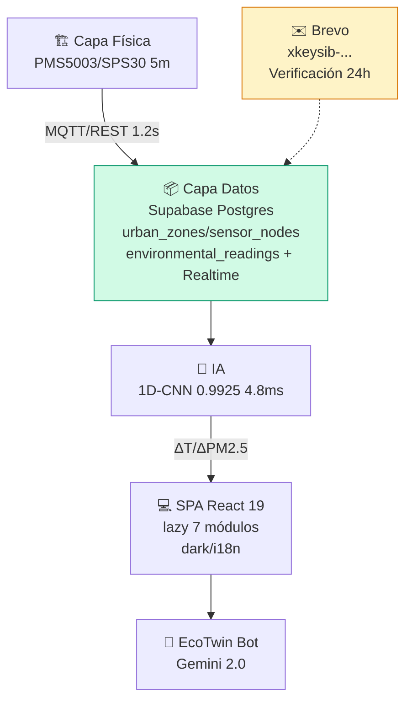

<div align="center">

# 🌿 Gemelo Digital Microescala — Calidad del Aire y NbS | Trujillo, Perú

### Simulador físico-virtual a 5 m × 5 m para mitigar contaminantes e isla de calor urbana con IoT, IA y Soluciones basadas en la Naturaleza — ahora multi-departamento y con Supabase + Brevo

<p>
  <a href="https://github.com/jfloriana/gemelo-digital-trujillo"></a>
  <a href="https://vercel.com"></a>
  
  
  
  
</p>

<p>
  
  
  
  
  
  
</p>

**Proyecto de Tesis de Posgrado — Universidad Nacional de Trujillo** · **Ing. Joel Anderson Florian Arévalo** (Investigador Principal) & **Ing. Jason Anderson Galvéz Luna** (Co-Investigador) · Investigación aplicada a planificación urbana y resiliencia climática multi-departamento

[🚀 Demo en Vercel](#despliegue) · [📖 Documentación](#tabla-de-contenidos) · [🗄️ Supabase](#supabase--analítica) · [✉️ Brevo](#brevo--verificación) · [🐛 Reportar Issue](https://github.com/jfloriana/gemelo-digital-trujillo/issues)

</div>

---

<div align="center">

| Investigadores | Ámbito | Resolución | Beneficio Estimado |
| :---: | :---: | :---: | :---: |
| **Ing. Joel A. Florian Arévalo** & **Ing. Jason A. Galvéz Luna** | 6 zonas piloto (La Libertad) + CRUD 25 departamentos · 6 nodos IoT | **5 m × 5 m** · H/W 0.8 – 2.1 | **132 500 hab.** · 41 000 en riesgo crítico |

</div>

---

## ✨ Novedades 2026.3

- **Supabase Postgres + Realtime** — 11 tablas (`urban_zones` con `department`, `sensor_nodes`, `environmental_readings` separada, `ai_models`, `nbs_interventions`, `simulation_scenarios` + `simulation_scenario_nbs`, `thesis_objectives`/`metrics`, `profiles` + `email_verifications`, `ingestion_logs`) con RLS por rol y Realtime en `environmental_readings`/`urban_zones`. `src/hooks/useSupabaseData.ts` reemplaza `trujilloData.ts` hardcoded.
- **Auth Supabase + Brevo** — `src/context/AuthContext.tsx` migrado de `localStorage/SHA-256` a `supabase.auth` + `public.profiles` (`user_role` enum, trigger `handle_new_user`). Registro envía **email profesional con botón “Verificar mi correo”** vía `api/send-verification.js` (Brevo `xkeysib-...`, `bcc` a tu correo para ver diseños) con token `email_verifications` 24h → `api/verify.js` → `profiles.email_verified=true`; login bloquea si no verificado (solo demo limitado entra con banner ámbar).
- **Multi-departamento Perú** — `UrbanZone.department` + migración `supabase/schema.sql` (`department text default 'La Libertad'` + `idx_zones_department`), `ZoneFormModal.tsx` con selector 25 departamentos (Amazonas…Ucayali), filtro por departamento en `DiagnosisModule` y `Header` muestra `district, department`.
- **CRUD Zonas manual** — `ZoneFormModal.tsx` (crear/editar/eliminar) con RBAC `canModifyZones` (`investigador`/`planificador`), Realtime auto-actualiza lista.
- **Dark/Light + i18n 6 idiomas** — `ThemeContext.tsx` (`localStorage trujillo_theme`, `prefers-color-scheme`, `Tailwind @custom-variant dark`) + `I18nContext.tsx` (`ES/EN/ZH/DE/FR/PT`, `localStorage trujillo_lang`, 447 clases con `dark:`), botón Sol/Luna y selector `Globe` en `Header`.
- **Performance** — `vite.config.ts` `manualChunks` (`charts`, `pdf`, `docx`, `supabase`) + `React.lazy`/`Suspense` para 7 módulos → `index-*.js` 673 kB (antes 2,2 MB) + chunks separados.
- **Tesis APA 7** — `exportUtils.ts` `exportToWord` reescrito: portada UNT, Resumen/Abstract, índice, 5 capítulos OE1-OE5 dinámicos (tablas N zonas/sensores/modelos/NbS/escenario), referencias APA 7 (13) y apéndices multi-página (`Times New Roman`, `PAGE/NUMPAGES`).
- **PWA + SEO** — `public/favicon.svg` (degradado emerald), `manifest.json`, `robots.txt`, `sitemap.xml`, `og:image`/`theme-color` en `index.html`.
- **Tests** — `vitest.config.ts` + `src/test/supabase.test.ts` (`npm test`).

---

## 📑 Tabla de Contenidos
<details><summary><strong>click para expandir</strong></summary>

- [Vista Previa](#-vista-previa)
- [Características](#-características-principales)
- [Stack](#-stack-tecnológico)
- [Arquitectura](#-arquitectura-del-sistema)
- [Supabase](#supabase--analítica)
- [Brevo Verificación](#brevo--verificación)
- [Asistente IA](#-asistente-ia--ecotwin-bot)
- [Requisitos](#-requisitos-previos)
- [Instalación](#-instalación)
- [Variables de Entorno](#-configuración--variables-de-entorno)
- [Ejecución](#-ejecución)
- [Scripts](#-scripts-disponibles)
- [Estructura](#-estructura-del-proyecto)
- [Módulos](#-módulos-de-la-plataforma)
- [Despliegue](#-despliegue--vercel-auto-deploy)
- [Seguridad .gitignore](#-seguridad--archivos-no-subidos)
- [Roadmap](#-roadmap-y-limitaciones)
- [Licencia](#-licencia-y-créditos)
</details>

---

## 🚀 Características Principales
<div align="center">

| Módulo | Descripción | Destacado |
| :--- | :--- | :--- |
| **🏙️ Gemelo 3D** | Canvas 2.5D isométrico | Malla 5 m · flujo LBM · UHI · PM2.5 Realtime Supabase |
| **🤖 EcoTwin Bot** | Chatbot flotante | Gemini 2.0 Flash + fallback · TTS/STT · Recomienda NbS por zona |
| **🔬 OE1 Diagnóstico** | Microescala + CRUD zonas | Δ PM2.5 285% · 6 zonas La Libertad + 25 deptos · filtro |
| **🏗️ OE2 Arquitectura** | 3 capas + REFLECT | Latencia 1.2s · QA/QC 2 etapas R² 0.94 |
| **🧠 OE3 IA** | 5 modelos | **1D-CNN R² 0.9925 / 4.8 ms** |
| **🌳 OE4 Simulador** | A/B + persistencia | 5 NbS · flora nativa · ΔT −3.8°C · guarda en `simulation_scenarios` |
| **✅ OE5 Validación** | Hipótesis | p < .001 · B/C 3.4 · Tesis APA 7 multi-página |
| **🔐 Auth** | Supabase + Brevo | Email verificado 24h · demo limitado · RBAC 5 roles |
| **🌓 UI** | Dark/Light + i18n | 6 idiomas · favicon · PWA |
| **📄 Exportación** | Excel/PDF/Word/CSV | Word APA 7 dinámico |

</div>

---

## 🛠️ Stack Tecnológico
| Capa | Tecnología | Versión | Rol |
| :--- | :--- | :--- | :--- |
| **UI** | React | `19.0.1` | SPA + lazy |
| **DB/Auth/Realtime** | Supabase | `2.115` | Postgres + RLS + Auth + Realtime (`@supabase/supabase-js`) |
| **Email** | Brevo | `3.0` | `api/send-verification.js` + `supabase/functions/send-verification-email` |
| **Build** | Vite | `6.2` | `manualChunks` + `@vitejs/plugin-react` |
| **Estilos** | Tailwind | `4.1` | `ThemeContext` `dark:` |
| **Gráficos** | Recharts | `3.10` | Lazy |
| **Export** | jspdf/docx/xlsx | `4.2/9.7/0.18` | Lazy chunks `pdf`/`docx` |
| **Tests** | Vitest | `5.0` | `jsdom` + `@testing-library` |
| **Tipos** | TypeScript | `5.8` | `ES2022` |

---

## 🏛️ Arquitectura del Sistema
<div align="center">



</div>

### Supabase — Analítica
`supabase/schema.sql` (11 tablas, enums, `profiles` trigger, `email_verifications` 24h, `department` + índices) y `supabase/seed.sql` (6 zonas La Libertad + 6 nodos + 72 lecturas + 5 IA + 5 NbS). `src/hooks/useSupabaseData.ts` hace `select` + `channel('realtime-zones'/'realtime-readings')`. RLS: `profiles` `select using(true)` + `is_privileged()` para escritura zonas.

### Brevo — Verificación
`api/send-verification.js` (Vercel) genera `crypto.randomBytes(32)` → `email_verifications` → `https://api.brevo.com/v3/smtp/email` con `xkeysib-...` (sender `jfloriana@unitru.edu.pe` verificado, `bcc` a ti) y HTML degradado emerald. `api/verify.js?token=&email=` marca `verified_at` + `profiles.email_verified=true`. `AuthContext` bloquea `login` si `email_verified=false` (solo demo entra con `getDemoPermissions()` limitado). Supabase `auth.config` `email_confirm` puede quedar OFF (usamos Brevo 100%).

---

## 🤖 Asistente IA — EcoTwin Bot
Burbuja `z-[60]` + modal `z-[70]` visible incluso sin login (`src/App.tsx:92`), `isDemo` banner ámbar.

---

## 📋 Requisitos Previos
Node 20 LTS, npm 9, Git 2, Supabase project (`gcjdkukmwsntyvbvucmo.supabase.co`), Brevo sender verificado (`jfloriana@unitru.edu.pe`).

---

## ⚡ Instalación
```bash
git clone https://github.com/jfloriana/gemelo-digital-trujillo.git
cd gemelo-digital-trujillo
npm install
cp .env.example .env.local  # completa
npm run lint && npm test && npm run build
```

---

## 🔐 Configuración — Variables de Entorno
`.env.example` es plantilla sin secretos (sí se sube). `.env*` está en `.gitignore:7` (no se sube):

```env
# GEMINI
GEMINI_API_KEY="..."
VITE_GEMINI_API_KEY="..."  # Vite expone VITE_*

# SUPABASE (Config = público, con VITE_ para browser)
VITE_SUPABASE_URL="https://gcjdkukmwsntyvbvucmo.supabase.co"
VITE_SUPABASE_ANON_KEY="eyJhbG...anon..."
# Solo server (Secret, sin VITE_)
SUPABASE_URL="https://gcjdkukmwsntyvbvucmo.supabase.co"
SUPABASE_SERVICE_ROLE_KEY="eyJhbG...service_role..."
BREVO_API_KEY="xkeysib-..."
# opcional Vercel: BREVO_SENDER_EMAIL="jfloriana@unitru.edu.pe"

APP_URL="http://localhost:3000"
```

| Variable | Secreto | Dónde | Uso |
| :---: | :---: | :--- | :--- |
| `VITE_GEMINI_API_KEY` | No* | Vercel Config | Browser Gemini |
| `VITE_SUPABASE_URL/ANON` | No* | Vercel Config | Browser Supabase (RLS protege) |
| `SUPABASE_SERVICE_ROLE_KEY` | **Sí** | Vercel Secret + `.env.local` local | `api/*` server |
| `BREVO_API_KEY` | **Sí** | Vercel Secret | `api/send-verification` |
| `GEMINI_API_KEY` | **Sí** | Vercel Secret | `vite.config.ts` define |

* `anon` es público por diseño (RLS). Nunca subas `.env.local`, `pg` ya está en `devDependencies`, y la DB password `D)TjP9t_*tuyC.)` fue expuesta en chat — **rótala en Supabase Dashboard → Database → Reset password**.

---

## ▶️ Ejecución
```bash
npm run dev      # http://localhost:3000  HMR
npm run build    # dist/ code-split
npm run preview  # http://localhost:4173
npm test         # vitest 2 tests
```

---

## 📜 Scripts Disponibles
`dev` `:3000` · `build` → `dist/` · `preview` `:4173` · `lint` `tsc --noEmit` · `test` `vitest run` · `clean` `rm -rf dist`

---

## 📁 Estructura del Proyecto
```
├── public/favicon.svg manifest.json robots.txt sitemap.xml
├── api/send-verification.js  api/verify.js  # Brevo 24h
├── supabase/schema.sql  seed.sql  functions/send-verification-email/
├── src/context/ThemeContext.tsx  I18nContext.tsx (6 idiomas)  AuthContext.tsx (Brevo)
├── src/hooks/useSupabaseData.ts  # Realtime zones/readings
├── src/components/modules/ZoneFormModal.tsx  # CRUD 25 deptos
└── src/utils/exportUtils.ts  # Word APA 7 dinámico
```

---

## 🧩 Módulos
OE1 Diagnóstico (CRUD zonas + filtro depto) · OE2 Arquitectura · OE3 IA (5) · OE4 Simulador (persiste) · OE5 Validación · Reports (APA 7) · Chatbot

---

## 🚀 Despliegue — Vercel Auto-Deploy
`vercel.json` SPA rewrite. Cada `git push main` despliega. **Env Vars en Vercel:** añade `VITE_SUPABASE_URL/ANON` como **Config** y `BREVO_API_KEY/SUPABASE_*` como **Secret** (si ves “VITE_ prefix exposes… → Change to Config” es correcto para `VITE_*`).

---

## 🔧 Solución de Problemas
| Síntoma | Solución |
| :--- | :--- |
| `406 profiles?select=email_verified` | `maybeSingle()` + `NOTIFY pgrst, 'reload schema'` (ya) |
| `429 email rate limit` | Brevo 100% ya no usa `auth/v1/resend`; espera 2 min si es `token` |
| `[DOM] autocomplete` | Ya con `autoComplete="email/current-password/new-password/off"` |
| `A listener ...` | Extensión Chrome, ignora o incógnito |
| Brevo 300 intacto | Remitente no verificado → usa `jfloriana@unitru.edu.pe` verificado |

---

## 🔒 Seguridad — Archivos No Subidos
Repositorio **público**: `.gitignore` ignora `node_modules/ dist/ .env*` (pero `!.env.example` sí se sube como plantilla). **Nunca** se suben: `.env.local`, `.env`, `*.log`, `coverage/`, `pg` solo dev. Verifica con `git ls-files | grep -E "^\.env$|service_role|xkeysib"` → debe dar vacío (ya verificado). Si expusiste DB password, rótala.

---

## 🗺️ Roadmap
Datos simulados `Math.random()` → MQTT real + TimescaleDB. Canvas 2.5D → WebGL. Tests ya con `vitest`.

---

## 📜 Licencia y Créditos
| | Detalle |
| :--- | :--- |
| **Licencia** | `Apache-2.0` |
| **Autores** | **Ing. Joel Anderson Florian Arévalo** (Tesista Líder) & **Ing. Jason Anderson Galvéz Luna** (Co-Investigador) — UNT |
| **Contacto** | `joelandersonarevalo@gmail.com` / `jason.galvez@unt.edu.pe` — CC diseños a `joelandersonarevalo@gmail.com` vía `bcc` Brevo |
| **Repo** | `jfloriana/gemelo-digital-trujillo` |
